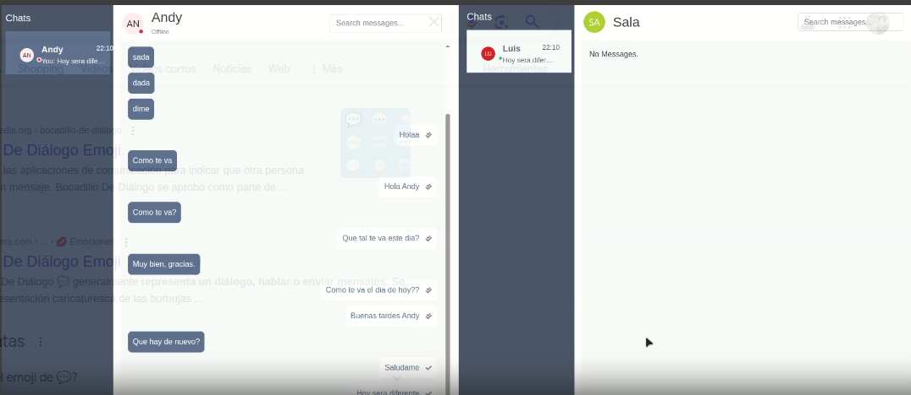

# WebSocket chat en tiempo real 💬


Características:
-Autenticación con JWT
-Verificación de no soy un robot
-Mensajería en tiempo real
-Estado de usuarios en línea
-Errores y alertas personalizadas
-Filtro avanzado de búsqueda
-Indicador de mensajes urgentes
-Indicador de mensajes por matería
-Manejo de archivos estaticos
-Despliegue en Railway.app

## Pasos para hacer uso del proyecto

```
#Clonar repositorio
#Crear y acivar el entorno virtual
python -m venv venv && source venv/bin/activate

#Instalar archivo requirements
pip install -r requirements.txt

#Cargar las migraciones
python manage.py makemigrations && python manage.py migrate

#Ejecutar el proyecto
python manage.py runserver
```